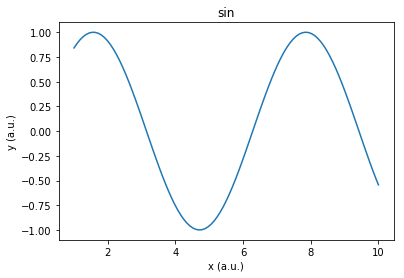
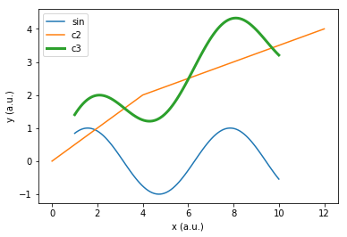
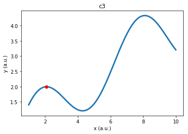
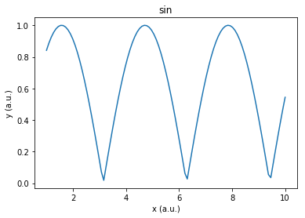
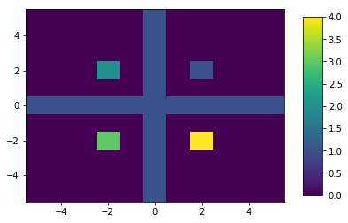
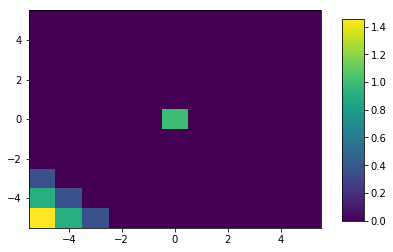
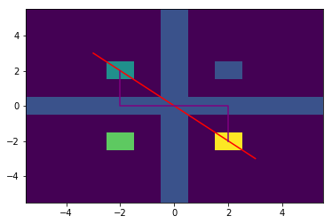
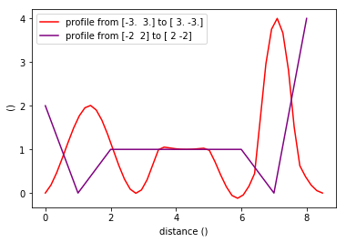
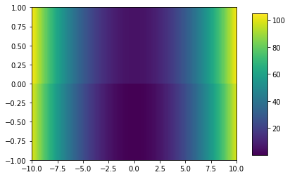

# Motivation
With numpy, scipy and matplotlib, python offers great packages for analyzing scientific data. However, they all force the user to think of their data in terms of lists. Things become messy when you just want to look at one part of your data (e.g. "Where is the peak between x=4.1 and x=5.2?") or when comparing two sets of data which do not share the same x entries.

The goal of simscidapy is to overcome these issues and to allow you to think of your data as curves or graphs and in terms of their physical units instead of indices of lists. Since it omits all these details, you gain time and your code becomes much shorter and better readable.

simscidapy offers the most common operations for treating your data but also allows you to fall back to the "standard" numpy way for more sophisticated problems.

Finally, simscidapy is object-oriented since it wraps all information concerning one set of data into one object. For complex data analysis problems, this helps you keeping a clear structure and readable code.

# Installation
Install the package using pip:
```
pip install simscidapy 
```

# Examples
## Creating and plotting a Curve


```python
from simscidapy import Curve

# create a first Curve object
import numpy as np
x1 = np.linspace(1,10,101)
c1 = Curve(x=x1,y=np.sin(x1),
            title="c1",
            x_label="x",x_unit="a.u.",
            y_label="y",y_unit="a.u.")

# and plot it
c1.plot_standalone()
```





## Forget about the details of your data
The first strong point of simscidapy is that you don't need to worry about the exact representation of your data when working with several data sets.


```python
# create a second Curve object defined at different x
c2 = Curve(xy=[(0,0),(4,2),(12,4)],title="c2") 

# work with the two:
c3 = c1+c2 # c3 will be defined on the same points as c1
c3.set_plot_properties({'title':'c3','plot_args':{'linewidth':3}}) # change some of its plotting properties

Curve.plot_several_curves([c1,c2,c3])
```





## Think in physical units instead of indices
Assume, you want to find the position of the maximum of c3 between 0 and 4. This is exactly what you will tell simscidapy. There is no need to worry about which indices of your list of data points this corresponds to.


```python
max = c3.get_maximum(x_range=(0,4))
print(f"The maximum between 0 and 4 is at {max}")

# plot c3 and the maximum
import matplotlib.pyplot as plt
fig, ax = plt.subplots()
c3.setup_plot(ax)
c3.plot(ax)
ax.plot(*max,'or')
plt.show()
```

    The maximum between 0 and 4 is at [2.08, 1.9963329795075166]
    





## Full compatibility with oldschool numpy data tweaking
If you need a functionality that is not implemented in simscidapy, you can always come back to the standard numpy and scipy methods.

For example, let us take the absolute value of c1.


```python
c1.apply_transformation(lambda x,y: (x,np.abs(y)))
c1.plot_standalone()
```





There are also getter functions to get x and/or y numpy arrays out of a given range.

## 2D data
The Map class of simscidapy offers rudimentary tools for treating 2D data sets, which you might get from two parameter sweeps and which are often represented by heatmaps. 


```python
from simscidapy import Map
# Create some dummy data
d = np.zeros((11,11))
d[5][:] = 1
d.T[5][:] = 1
d[7][7] = 1
d[3][7] = 2
d[3][3] = 3
d[7][3] = 4

m = Map(d)
m.plot_standalone()
```





You can play with this map, crop, rotate, rescale, move it etc. 
Similar to the Curve class, Map also takes care of interpolation when working with different data sets.


```python
# first map: non zero at zenter
d1 = np.zeros((11,11))
d1[5][5] = 1
m1 = Map(d1)

# second map: non zero in lower left corner; note: it is of different resolution than the first map
d2 = np.zeros((4,4))
d2[0][0] = 2
m2 = Map(d2,size=(11,11))

m3 = m1+m2 # default interpolation is linear, other options are available
m3.plot_standalone()
```





### Link with 1D Curves
You can smoothly go from 1D data to 2D an back.

First an example for extracting arbytrary 1D profiles from 2D data


```python
p1 = m.straight_profile((-3,3),(3,-3),50,interpolation_args={'method':'cubic'})
fig,ax = plt.subplots()
m.plot(ax)
p1.plot_trajectory(ax,plot_args={'color':'red'})
p1.set_plot_properties({'plot_args':{'color':'red'}})

p2 = m.profile([(-2,2),(-2,1),(-2,0),(2,0),(2,-1),(2,-2)])
p2.plot_trajectory(ax,plot_args={'color':'purple'})
p2.set_plot_properties({'plot_args':{'color':'purple'}})
plt.show()
```





```python
Curve.plot_several_curves([p1,p2])
```





Now the opposite: constructing a 2D Map from a set of 1D Curve data sets.


```python
### build a map from curves which are not defined on the same values; the from_curves function then interpolates them to fit on the same grid
x1 = np.linspace(-15,15,256)
c1 = Curve(x1,x1**2)
x2 = np.linspace(-10,10,256)
c2 = Curve(x2,x2**2)+5 # +5 just to see the difference between the two lines in the plot.
list_of_curves = [c1,c2]

m = Map().from_curves(list_of_curves,
                        y_spacing=1,
                        x_range=(-10,10), # let's only take the the range where both are defined
                        x_values=c2.get_x() # let's use the x values of the 2nd curve as a basis for the map; anything else could also be used
                        )
m.plot_standalone()
```





# More examples
You can find more examples in the Curve_Example.ipynb and Map_Examples.ipynb notebooks as well as in the testing code test_Curve.py and test_Map.py that come with the package

# Documentation
A simple documentation is provided in simscidapy.html
